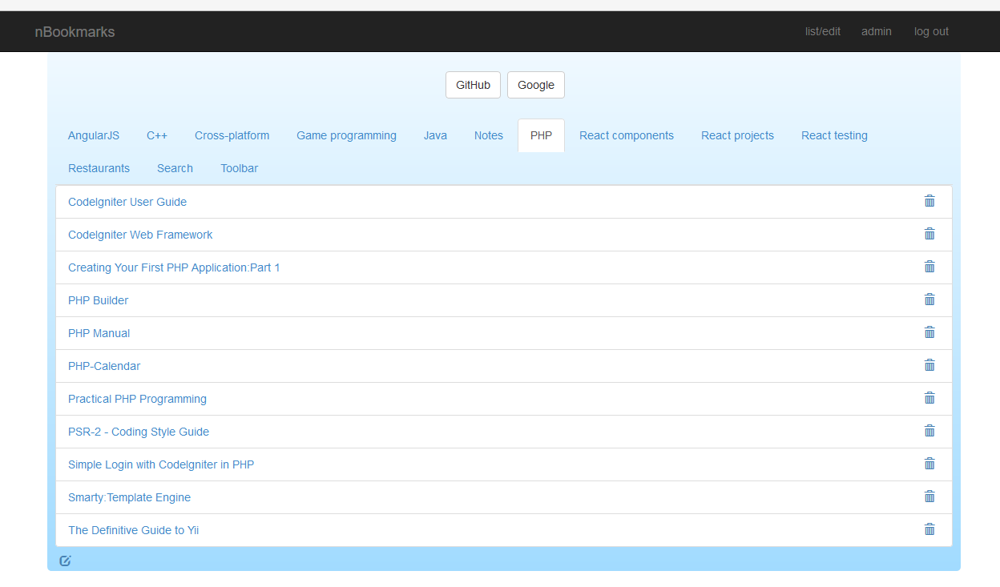
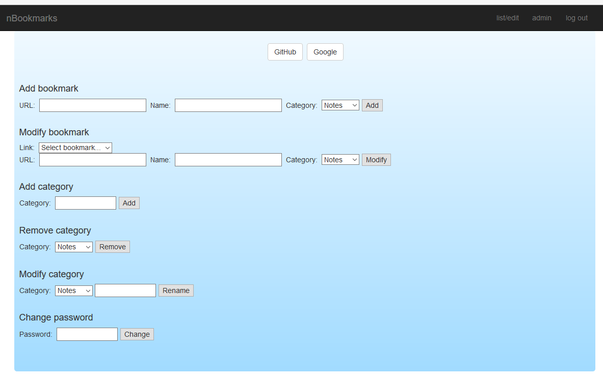
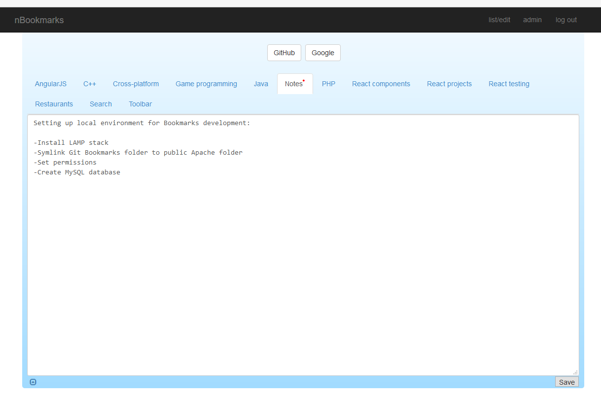

nBookmarks
==========

nBookmarks is an application to maintain list of bookmarks and notes. It has been implemented with CodeIgniter 3.x (REST API), React, and Twitter Bootstrap.

<h2>Features</h2>
  <ul>
     <li>Add and modify bookmark entries by category</li>
     <li>Add notes</li>
     <li>Basic authentication</li>
     <li>Admin interface to manage users</li>
     <li>Basic optimistic locking</li>
  </ul>

<h2>Installation</h2>

CodeIgniter <a href="https://codeigniter.com/userguide3/installation/index.html">installation instructions</a>

<h2>TODO</h2>

  <ul>
    <li>Drag & drop support</li>
    <li>Browser compatible import/export</li>
    <li>.</li>
    <li>.</li>
    <li>.</li>
  </ul>

<h2>Screenshots</h2>

