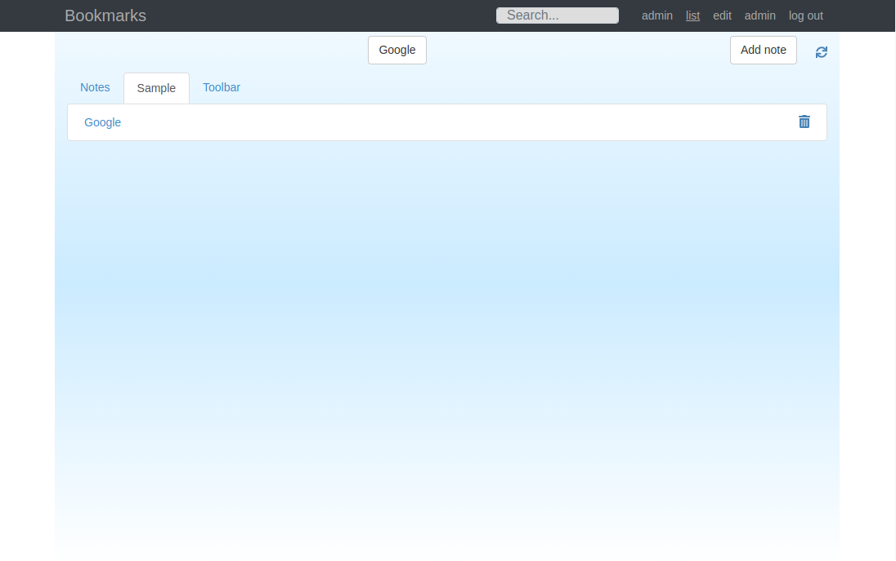

# nBookmarks

nBookmarks is an application to maintain list of bookmarks and notes. It has been implemented with CodeIgniter 4 (REST API), React, and Twitter Bootstrap.

## Features

- Add and modify bookmark entries by category
- Add notes
- Basic authentication
- Admin interface to manage users
- Basic optimistic locking
- Search

## Installation

CodeIgniter [installation instructions](https://codeigniter.com/user_guide/installation/index.html)

### Basic setup

1. Create DB table with `data/users.sql`
2. Create server configuration (e.g. Apache VirtualHost `data/bookmarks.com.conf`)
3. Modify `.env` and `react-app/.env` according to set-up
4. Build react-app: `npm install && npm run build`

### Todo

- Drag &  drop support
- Browser compatible import/export
- .
- .
- .

## Screenshots

