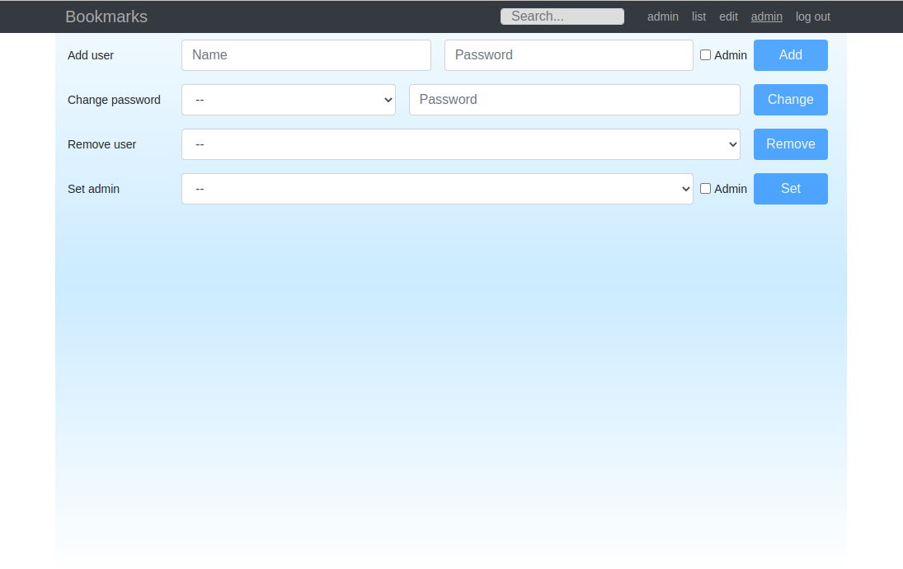

# nBookmarks

nBookmarks is an application to maintain list of bookmarks and notes. It has been implemented with CodeIgniter 4 (REST API), React, and Twitter Bootstrap.

## Features

- Add and modify bookmark entries by category
- Add notes
- Basic authentication
- Admin interface to manage users
- Basic optimistic locking
- Search

## Installation

CodeIgniter [installation instructions](https://codeigniter.com/user_guide/installation/index.html)

### Basic setup

1. Define database settings: `/app/Config/Database.php`
2. Create DB table with `/data/users.sql`
3. Set encryption key: `/app/Config/Encryption.php`, `$key`
4. Build react-app: `npm install && npm run build`

### Changing base URL

1. Change `$baseURL` in `/app/Config/App.php`
2. Change `REACT_APP_API_URL` in `/react-app/.env`

### Todo

- Drag &  drop support
- Browser compatible import/export
- .
- .
- .

## Screenshots

